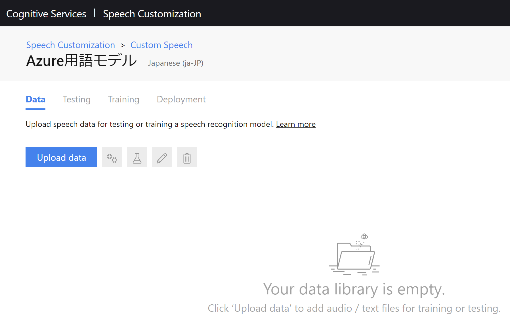
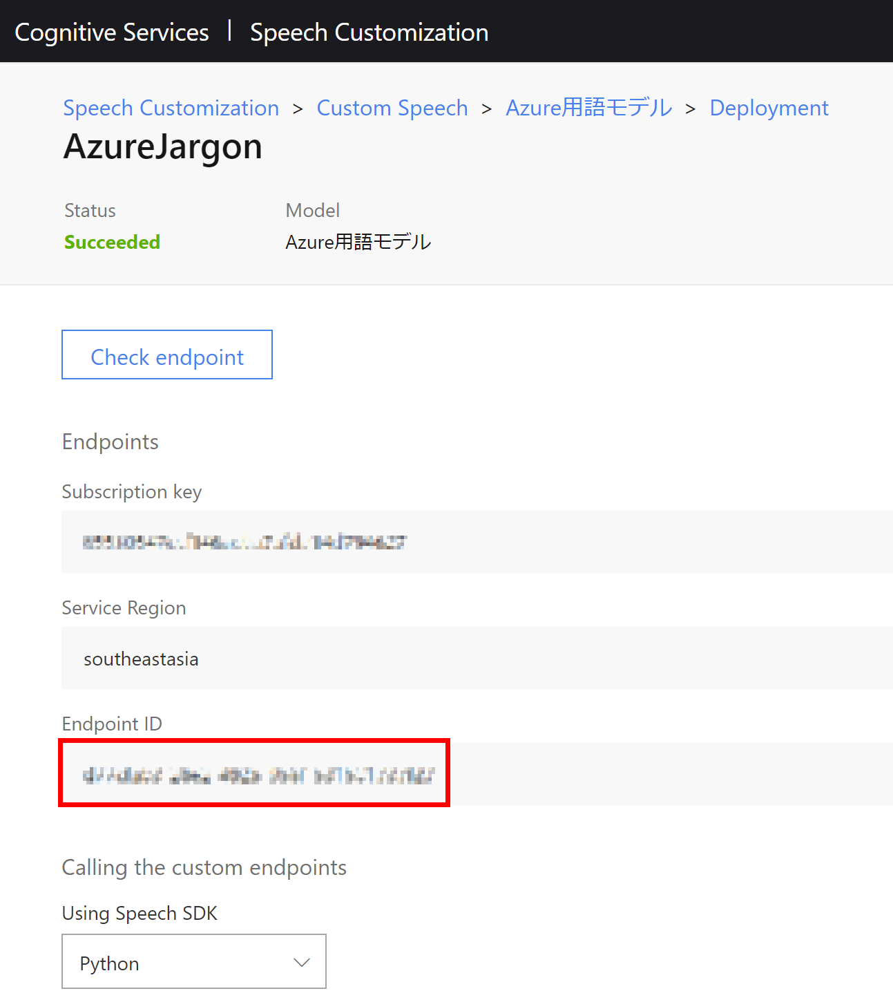

# Cognitive-Services-Custom-Speech-sample
Microsoft Cognitive Services Speech Services のカスタム文字起こし機能利用の手順

## 概要
Microsoft Cognitive Services Speech Services (以下 Speech Services) では、通常の Microsoft が事前にトレーニングを行ったモデル（ベースライン モデル）を利用した文字起こしの他に、自分の所属する組織の特別な言い回しや用語などをトレーニングさせる「言語モデル」や、特殊な音響環境での文字起こしを行うための「音響モデル」、そして型番などの特殊な「発音」をトレーニングする「発音モデル」の３つのカスタマイズ機能を備えています。
「音響モデル」「発音モデル」は現在日本語のサポートがありませんので、ここでは「言語モデル」をどのように作成するのか、画面を交えて解説します。

## Azure Cognitive Services Speech Services Speech Customization モデル作成手順

### サインイン

1. Speech Servicesでカスタムされたモデルを使用するには、以下のサイトでモデルの作成を行う必要があります。サイトに移動後、右上の「Sign in」よりサインインします。  
   [Speech Customization](https://speech.microsoft.com/)
    

### プロジェクトの作成

2. Speech Customization のトップ画面が表示されますので「Custom Speech」ボタンをクリックします。
    

3. プロジェクトの作成画面が表示されますので「New Project」をクリックします。
    

4. プロジェクトの設定画面が表示されますので、下記のように必要な項目を記入します。記入後「Create」をクリックします。
    

5. これでプロジェクトが作成されました。続いてモデルを作成するためのデータを投入します。設定したプロジェクトの名前のリンクをクリックします。
    

### データのアップロード

6. データのアップロード画面が開きますので「Upload data」をクリックします。
    

7. 現時点では日本語では「言語モデル」しかサポートされないため、ここでは「Related text」を選択して、「Next」をクリックします。
    

8. 言語データセットに判別しやすい名称を記入し、「Next」をクリックします。
    

9.  データのアップロード画面が表示されますので「Browse files...」をクリックします。
     

10. 対象となる言語データセットが入ったファイルを選択し、「Open」をクリックします。このリポジトリではサンプルとして[Azure用語サンプル](AzureTerm.txt)を置いてありますので、このファイルを参考に言語モデルデータを作成してみてください。
     

11. 設定が完了すると以下のような画面になります。ウィンドウ下部のチェックボックスにチェックを入れ、「Upload」をクリックします。アップロード可能なファイル内容の詳細については、ウィンドウ内にある「View data requirements」をクリックしてご確認ください。
     

12. アップロードが完了し、内容の確認が終わると処理が開始されます。「Status」が「Processing」から「Succeeded」に変われば処理は完了です。数百行程度のファイルであれば、1分以内に処理は完了します。
     
     

### トレーニング

13. 続いてモデルを作成します。アップロードが完了したデータの右側にある「Train」の歯車アイコンをクリックします。
     

14. モデル名を入力して「Next」をクリックします。
     

15. 日本語環境の場合は 2019年5月 時点では既定の選択肢のみが表示されます。そのまま「Next」をクリックします。
     

16. 先ほどアップロードしたデータが選択されていることを確認し、「Train」をクリックします。「Add test in the next step」というチェックボックスがありますが、これは音声ファイルを使うテストを作成することができる機能です。今回はオフのまま進めます。
     

17. トレーニングの状況を確認するために「Training」タブをクリックします。
     

18. 通常、処理を実行したばかりの場合には「Status」が「Processing」となっています。
     

19. 「Status」が「Succeeded」に変わればモデルの作成は完了です。
     

### デプロイ

20. 続いて API としてアクセスするためのエンドポイントを作成するためにデプロイを行います。トレーニングが完了したモデルの右側にある「Deploy」アイコンをクリックします。
     

21. 「New endpoint」の画面が開くので、エンドポイント名やモデルの選択を行います。2019年5月 時点では、エンドポイント名は日本語を指定すると作成されない問題がありますので、ここでは英語表記でエンドポイント名を指定します。エンドポイントにアクセスした際の音声やログを取得する場合には、「Log conten from this endpoint」のチェックボックスをオンにします。このチェックを入れる際にはプライバシー保護のために、使用するアプリケーションなどで録音される旨の表示が必要です。
     

22. エンドポイントの作成状況を確認するには「Deployment」タブをクリックします。
     

23. 恐らくすぐにエンドポイントは作成されますが、下記のように「Succeeded」に変わればエンドポイントの作成は完了です。
     

24. エンドポイントの詳細を確認するためにエンドポイント名をクリックします。
     

25. 表示された画面の「Endpoint ID」を使用してカスタムモデルのテストを行いますので、メモ帳などに保存します。
     

### 動作確認

26. ベースラインモデルとカスタムモデルの比較を行うには[「Speech-to-text WPF sample」](https://github.com/Azure-Samples/cognitive-services-speech-sdk/tree/master/samples/csharp/dotnet-windows/speechtotext-wpf)が便利です。ここではこのアプリケーションを日本語化しているものを使用してテストを行います。
    
27. アプリを起動し、「設定」内の「認識方式」を開き、「両方」を選択します。
     

28. 次に「リージョンと言語」を開き、適切に設定されていることを確認します。
     

29. 次に「キーの設定」を開き「サブスクリプション キー」「Custom Speech モデル ID」に適切な値を入力し、「キーの保存」をクリックします。
     

30. 最後に「入力ソース」を開き「マイクを使う」を選択し、「開始」をクリックすることで音声認識が開始します。
     
    
31. ベースライン モデルとカスタム モデルの出力に差異があり、カスタム モデルが正しく認識されていれば、投入した学習データのトレーニングが適切に行われたということになります。もし期待されるような結果と異なる場合には、更に補強するためのデータを追加し、手順5以降を繰り返し実行してください。
     
    >「SearchScorable は、メッセージが search about で始まる場合に起動されます。」という文章でトレーニングを行った例

以上